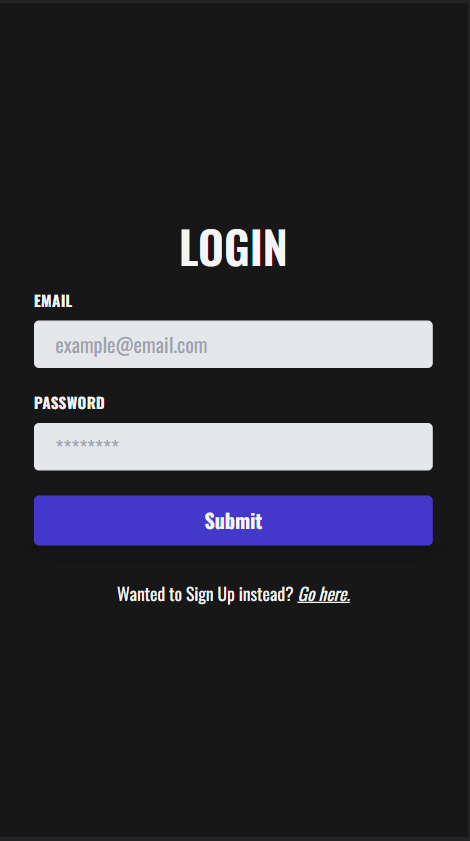
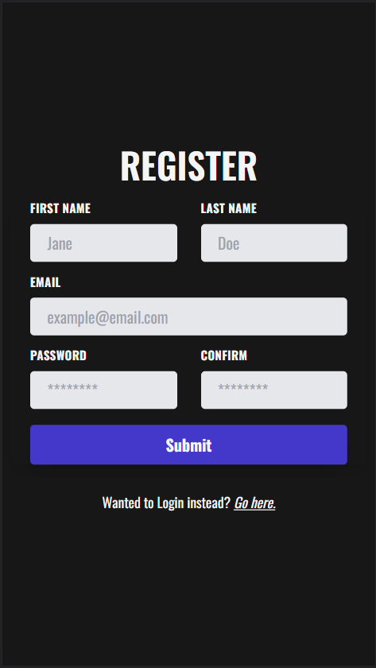
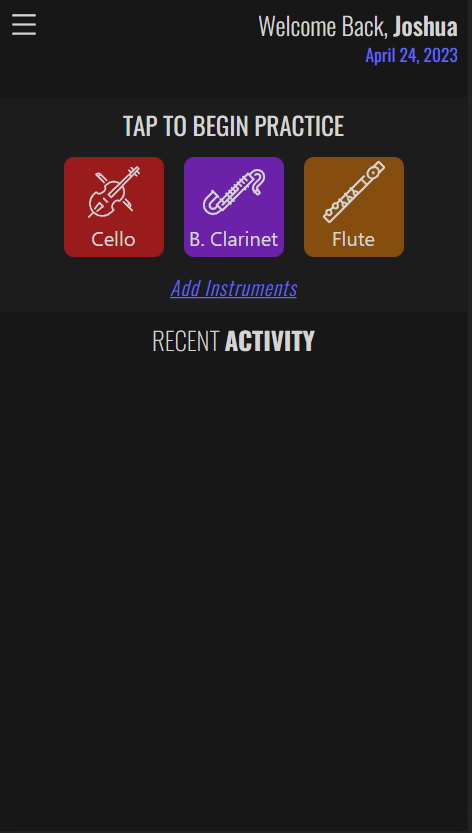
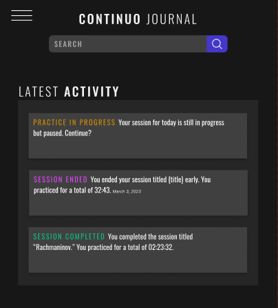

# Continuo
Musician practice journal app

Live Link: *Coming soon (I took it down to save some money)*

## Technology Stack

### Planning
* Figma
* MySQL workbench (ERD Design/Visualization)

### Front End
* React (Vite) / Asp.Net MVC
* TailwindCSS

### Back End
* Asp.Net Web API
* Entity Framework Core
* Custom JWT Authorization with refresh tokens.

### CI/CD and Deployment
* AWS Elastic Beanstalk
* AWS RDS

## Minimum Viable Product
- [x] Authentication
- [x] Authorization views through JWT and Refresh Token
- [X] Dynamic Calendar View
- [ ] Many to Many Association between Practice Tasks and Practice sessions.
- [x] User instrument creation with icon selection
- [ ] One Practice Session can involve multiple instruments.
- [ ] Metronome for use during practice.
- [ ] Practice Session state is cached on DB and can be accessed across any authenticated devices.
- [x] CI/CD Through AWS Elastic Beanstalk

 
 
